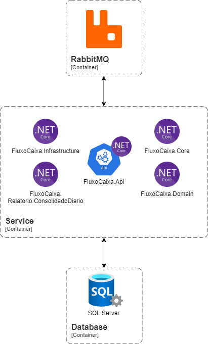

# Fluxo Caixa Desafio Opah

Aplicação para controle de fluxo de caixa e processamento de relatório.


## Tecnologias utilizadas

- .NET na versão 6
- SQL Server 2019 
- RabbitMQ


## Solução

### Alto Nível


### Baixo Nível




Lançamentos
  - A aplicação consiste em uma API para controlar o fluxo de caixa, adicionado lançamentos de crédito e débito, atualizando assim o saldo no caixa.

Relatórios
  - A aplicação também gera um relatório do consolidado diário, que fica disponível para download, no formato CSV, após o seu processamento.
  Cada solicitação de relatório requerida, é enviada a um tópico no RabbitMQ, para ser processado por um Worker Service.


## Design do código


## Executando o projeto

- Execute o seguinte comando para rodar os containers da aplicação.
```
docker-compose up -d
```

- Com o comando `docker-compose ps` você pode verificar se todos containers estão sendo executados.
- Você também pode ter o Docker Desktop para ter acesso aos containers em uma interface gráfica.
- Para abrir o swagger da api no navegador, acesse o [link](http://127.0.0.1:8001/swagger/index.html).
- Para verificar a saúde da api no navegador, acesse o [link](http://127.0.0.1:8001/healthz).
- Este são o usuário e a senha pré-configurados:
```
{
  "email": "admin@admin.com.br",
  "senha": "admin123"
}
```

## Postman Collection

[FluxoCaixa - Postman Collection](./postman_example/FluxoCaixaOpah - Collection.postman_collection.json)

### Observações:
- Lembrar de verificar o token de autorização na collection.
- Verificar a data no body na hora de solicitar o processamento de um relatório
- Verificar o Id do relatório na rota da requisição, para fazer download do relatório.
